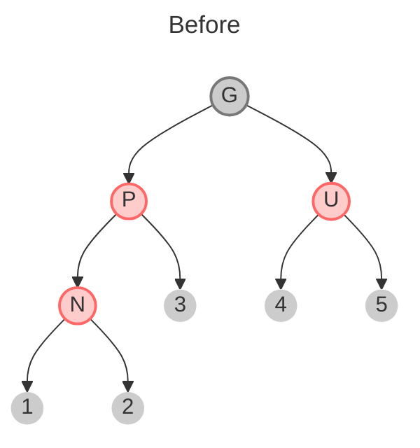
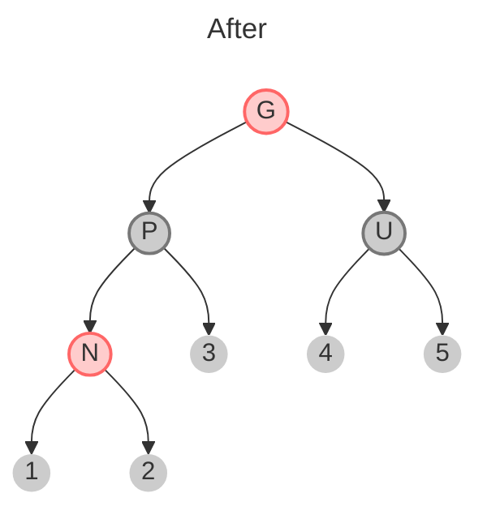
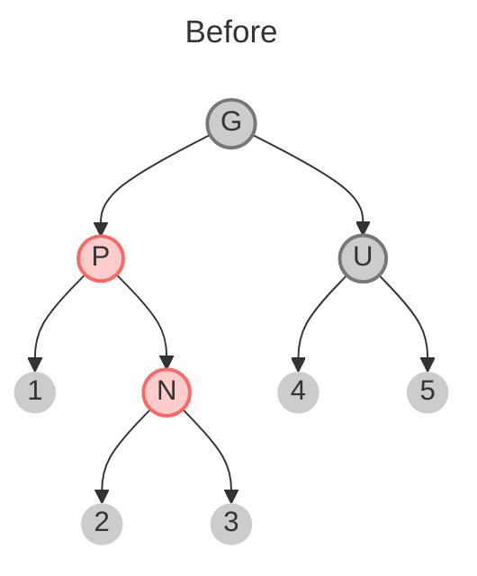
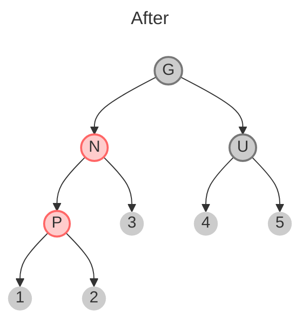
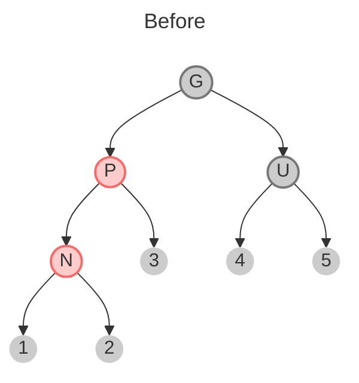
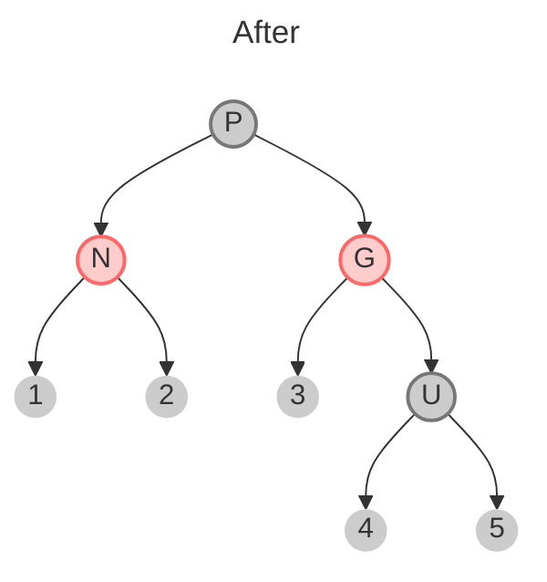

# Red Black Trees

### Insert
- `Tree_insert(x, T)` 
- `color(x)=red`
- Problem if `parent(x)` is red
- Good: property 4 (bh) is conserved

#### "Red son of red" problem
When `parent(x)` is red can happen 3 cases:

##### Case 1: Uncle of x is red

- Solution: `Recolor()`


##### Case 2: Uncle of x is black and it has the same side of x

Solution: `leftRotate(T, p(x))`

##### Case 3: Uncle of x is red and it has the opposite side of x

- Solution: `rightRotate(T, p(x))`


#### Pseudocode
```
RB_insert(T, x):
	Tree_insert(T, x):
	color(x)<-red
	while x!=root(T) and color(x)=red do:
		if p(x)=left(p(p(x))) 
			y<-right(p(p(x))) //uncle
			if color(y)=red
				//case 1 recolour
			else if x=right(p(x))
					//case 2 leftRotate
				//case 3 rightRotate
		else
			//(same as then clause with “right” and “left” exchanged
	color(root(T))<-black
```

#### Time Complexity
- `Recolor()` $\Theta(\log n)$ 
	- We recolour every level
- `Rotation()` $\Theta(1)$
	- We do at most 2 `Rotation()` 

# Matrix multiplication
- $A\in\mathbb{R}^{n\times m}, B\in\mathbb{R}^{m\times l}\Rightarrow C\in\mathbb{R}^{n\times l}$  
- $A\times B = C$
- $C[i,j]=\sum_{k=1}^{m} A[i,k]\cdot B[k,j]$ 

### Simple algorithm
```
for i=1 to n
	for j=1 to n
		C[i,j]<-0
		for k=1 to n
			C[i,j]<-C[i,j]+A[i,k]*B[k,j]
return C
```

- **Time complexity** $\Theta(n^3)$

## Boolean Matrix Multiplication
- Is stated that:
	- $\nexists$ algorithm running in $O(n^{3-\epsilon}),\forall \epsilon >0$  

Divide an $n\times n$ problem into subproblems $\frac{n}{2}\times\frac{n}{2}$ 
- $r=a\times e + b \times g$ 
- $s=a\times f + b \times h$ 
- $t=c\times e + d \times g$ 
- $y=c\times f + d \times h$ 

- The sum is $\Theta(n^2)$ due to the two for loops

**Demonstration using recursion**
$T(n)=8T(\frac{n}{2})+\Theta(n^2)$
...

Total=$\sum_{i=0}^{\log n}c\cdot n^2 \cdot 2^i = c\cdot n^2 \sum_{i=0}^{\log n} 2^i = c\cdot n^2 n \Rightarrow O(n^3)$ 

