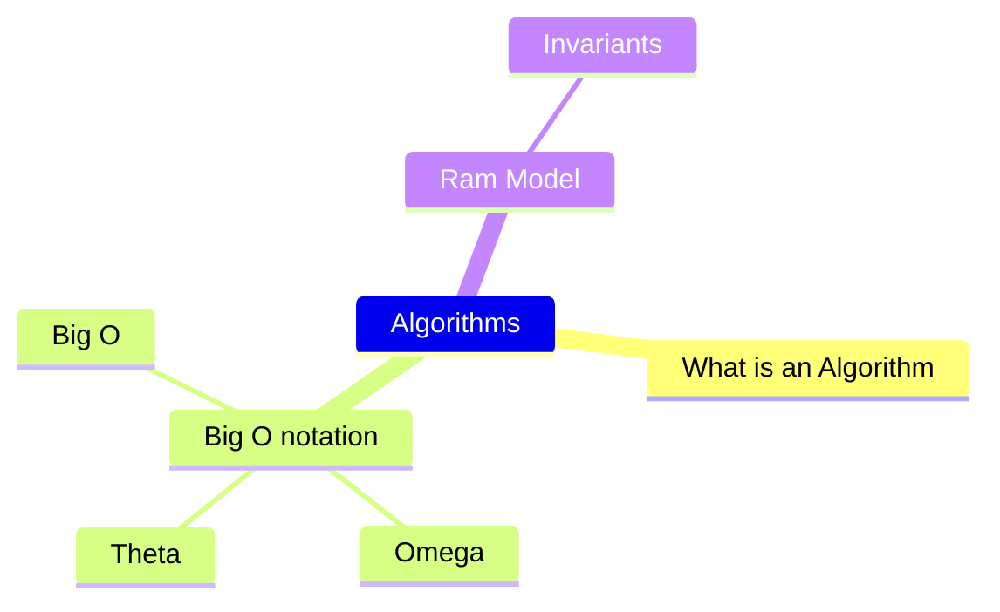
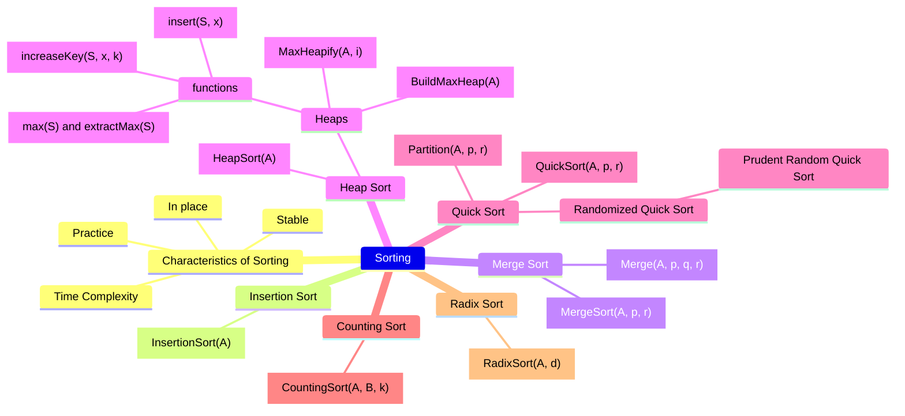
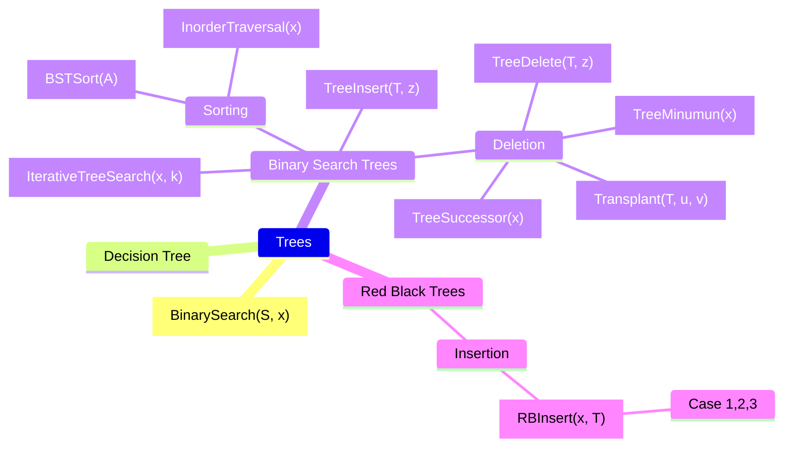
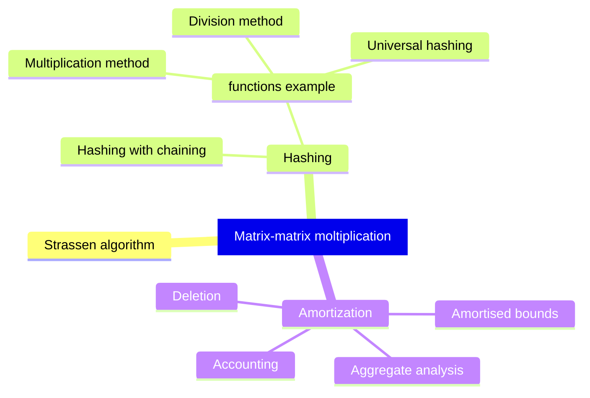
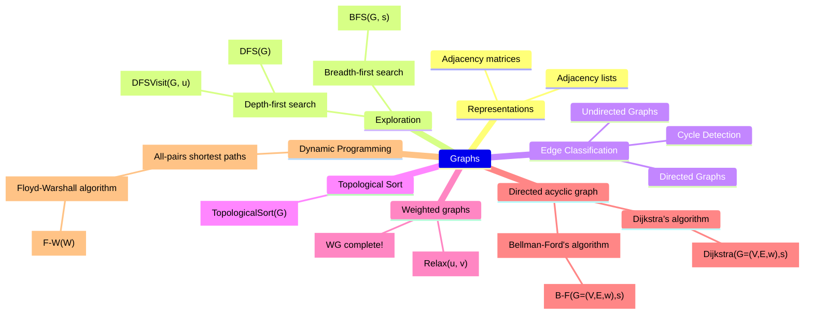
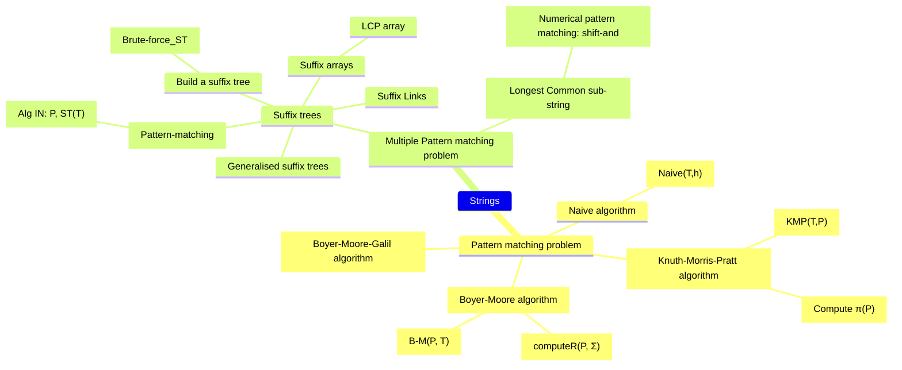

# Algorithms mindmap
index
## Algorithms

```mermaid
mindmap
Algorithms
    What is an Algorithm
    Big O notation
        Omega
        Theta
        Big O
    Ram Model
        Invariants
    
```

## Sorting

```mermaid
mindmap
Sorting
    Characteristics of Sorting
            Time Complexity
            In place
            Practice
            Stable
    Insertion Sort
        ["InsertionSort(A)"]
    Merge Sort
        ["MergeSort(A, p, r)"]
        ["Merge(A, p, q, r)"]
    Heap Sort
        Heaps
            functions
                ["insert(S, x)"]
                ["max(S) and extractMax(S)"]
                ["increaseKey(S, x, k)"]
            ["BuildMaxHeap(A)"]
            ["MaxHeapify(A, i)"]
        ["HeapSort(A)"]
    Quick Sort
        ["QuickSort(A, p, r)"]
        ["Partition(A, p, r)"]
        Randomized Quick Sort
            Prudent Random Quick Sort
    Counting Sort
        ["CountingSort(A, B, k)"]
    Radix Sort
        ["RadixSort(A, d)"]

```

## Trees

```mermaid
mindmap
Trees
    ["BinarySearch(S, x)"]
    Decision Tree
    Binary Search Trees
        ["IterativeTreeSearch(x, k)"]
        ["TreeInsert(T, z)"]
        Sorting
            ["BSTSort(A)"]
            ["InorderTraversal(x)"]
        Deletion
            ["TreeSuccessor(x)"]
            ["Transplant(T, u, v)"]
            ["TreeMinumun(x)"]
            ["TreeDelete(T, z)"]
    Red Black Trees
        Insertion
            ["RBInsert(x, T)"]
                Case 1,2,3
```

## Matrix-matrix moltiplication

```mermaid
mindmap
["Matrix-matrix moltiplication"]
    Strassen algorithm
    Hashing
        Hashing with chaining
        functions example
            Division method
            Multiplication method
            Universal hashing
    Amortization
        Deletion
        Amortised bounds
        Aggregate analysis
        Accounting
```

## Graphs

```mermaid
mindmap
Graphs
    Representations
        Adjacency lists
        Adjacency matrices
    Exploration
        ["Breadth-first search"]
            ["BFS(G, s)"]
        ["Depth-first search"]
            ["DFS(G)"]
            ["DFSVisit(G, u)"]
    Edge Classification
        Directed Graphs
        Undirected Graphs
        Cycle Detection
    Topological Sort
        ["TopologicalSort(G)"]
    Weighted graphs
        ["WG complete!"]
        ["Relax(u, v)"]
    Directed acyclic graph
        Dijkstra’s algorithm
            ["Dijkstra(G=(V,E,w),s)"]
        ["Bellman-Ford's algorithm"]
            ["B-F(G=(V,E,w),s)"]
    Dynamic Programming
        ["All-pairs shortest paths"]
            ["Floyd-Warshall algorithm"]
                ["F-W(W)"]

```

## Strings

```mermaid
mindmap
Strings
    Pattern matching problem
        Naive algorithm
            ["Naive(T,h)"]
        ["Knuth-Morris-Pratt algorithm"]
            ["Compute π(P)"]
            ["KMP(T,P)"]
        ["Boyer-Moore algorithm"]
            ["computeR(P, Σ)"]
            ["B-M(P, T)"]
        ["Boyer-Moore-Galil algorithm"]
    Multiple Pattern matching problem
        Suffix trees
            ["Pattern-matching"]
                ["Alg IN: P, ST(T)"]
            Build a suffix tree
                ["Brute-force_ST"]
            Suffix Links
            Suffix arrays
                LCP array
            Generalised suffix trees
        ["Longest Common sub-string"]
            ["Numerical pattern matching: shift-and"]
        

```