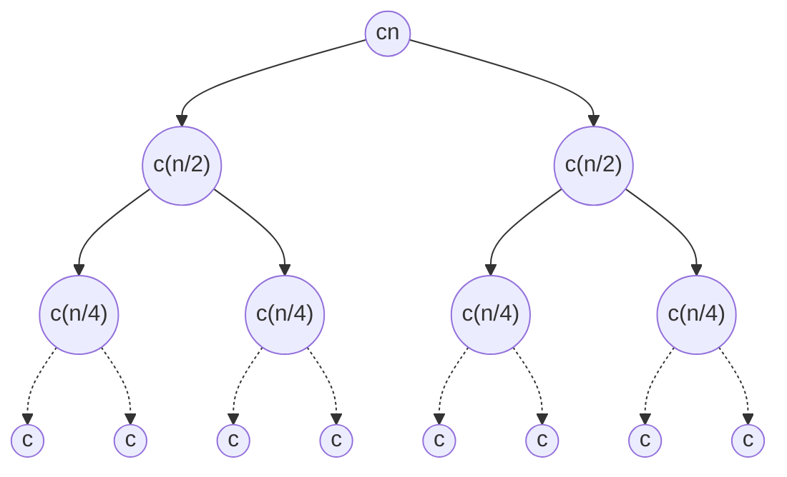

# Sorting Algorithms

**Simulation of algorithms:** For a visual representation of sorting algorithms, you can refer to [VisualGO](https://visualgo.net/en/sorting).

## Insertion Sort

- An **in-place** sorting algorithm.

#### Pseudocode

**Input:**
1. Comparison function $\le$
2. A sequence of $n$ items $\left\langle a_1, a_2,\dots,a_n  \right\rangle$

**Output:** A permutation $\left\langle b_1, b_2,\dots,b_n  \right\rangle$ such that $b_1 \le b_2 \le \dots \le b_n$

```python
Input A[i,...,n]
for i = 1 to n
    Insert A[i] into the sorted array A[1,...,i-1] by pairwise swapping
```

```py
InsertionSort(A)
    for j = 2 to A.length
        key = A[j]
        # Insert A [i] into the sorted sequence A[1..j-1].
        i = j-1
        while i > O and A[i] > key
            A[i+1] = A[i]
            i = i-1
        A[i+1] = key
```

#### Time Complexity

The time complexity can be determined as follows:

- Cost of calculating the loop condition: $O(n)$
- Cost of executing the for loop: $O(n)$
- Therefore, $T(n) = O(n^2)$

*Remember*:
- The sum of integers from 1 to (n-1) can be represented as $1+2+3+...+(n-1) = \sum_{i=1}^{n-1}i = \Theta(n^2)$.
- The cost of comparing numbers is typically $\Theta(1)$, but it can be higher for strings or other complex data types.

## Merge Sort

Use **divide-and-conquer** approach: break the problem into several **subproblems** that are similar to the original problem but smaller in size, solve the subproblems recursively, and then combine these solutions to create a solution to the original problem.

The **merge sort algorithm** operates as follows:
- **Divide**: Divide the n-element sequence to be sorted into two subsequences of n=2 elements each.
- **Conquer**: Sort the two subsequences recursively using merge sort.
- **Combine**: Merge the two sorted subsequences to produce the sorted answer.

Never used in practice because not better complexity than others and **not in-place**.

- ?Tree mergesort?
  
#### Pseudocode
**INPUT:**
1. Comparison function $\le$
2. A sequence of $n$ items $\left\langle a_1, a_2,\dots,a_n  \right\rangle$

**OUTPUT:** A permutation $\left\langle b_1, b_2,\dots,b_n  \right\rangle$ such that $b_1 \le...\le b_n$

```py
Merge(a, p, q, r)
    n1 = q-p+1
    n2 = r-q
    let L[1..n1+1] and R[1 ..n2+1] be new arrays
    for i = 1 to n1
        L[i] = A[p+i-1]
    for j = 1 to n,
        R[j] = A[q+j]
    L[n1+1] = inf
    R[n2+1] = inf
    i=1
    j=1
    for k=p to r
        if Lil < Ril
            A[k] = L[i]
            i = i + 1
        else A[k] = R[i]
    j=j+1

MergeSort
    if p<r
    q = floor([(p+r)/2])
    MergeSort(A, p, q)
    MergeSort(A, q+1, r)
    Merge(A, p, q, r)
```

- $\infin$ for the case when $L$ have all minor elements respect to $R$
#### Time Complexity

We have:
- **Divide**: Time to split the array $\Theta(1)$.
- **Conquer**: We recursively solve two subproblems, each of size $n=2$, which contributes $2T(n/2)$ to the running time.
- **Combine**: `Merge` procedure on an n-element subarray takes time $\Theta(n)$.

$$
T(n)= \begin{cases}\Theta(1) & \text { if } n=1 \\ 2 T(n / 2)+\Theta(n) & \text { if } n>1\end{cases}
$$
Rewrite the recurrence as:
$$
T(n)= \begin{cases}c & \text { if } n=1 \\ 2 T(n / 2)+c n & \text { if } n>1\end{cases}
$$
where the constant $c$ represents the time required to solve problems of size 1 as well as the time per array element of the divide and combine step.

We can generate a **recursion tree** to solve the recurrence:


Each level of the tree represents a smaller subproblem, with the top level corresponding to the original problem.
The **costs of each level** decrease by half, starting with $cn$ at the top level.
The **number of levels** in the tree is determined by the input size and is $\log n + 1$.

To calculate the total cost of the recurrence, the costs of all levels are summed up. Each level's cost is determined by the number of nodes, and as we move down the tree, the cost decreases by half.
The total cost of the recurrence is found to be $cn \log n + cn$ by summing up the costs of all levels.

By simplifying the expression and ignoring lower-order terms and constants, the **asymptotic growth rate** of the recurrence is determined to be $\Theta(n \log n)$.