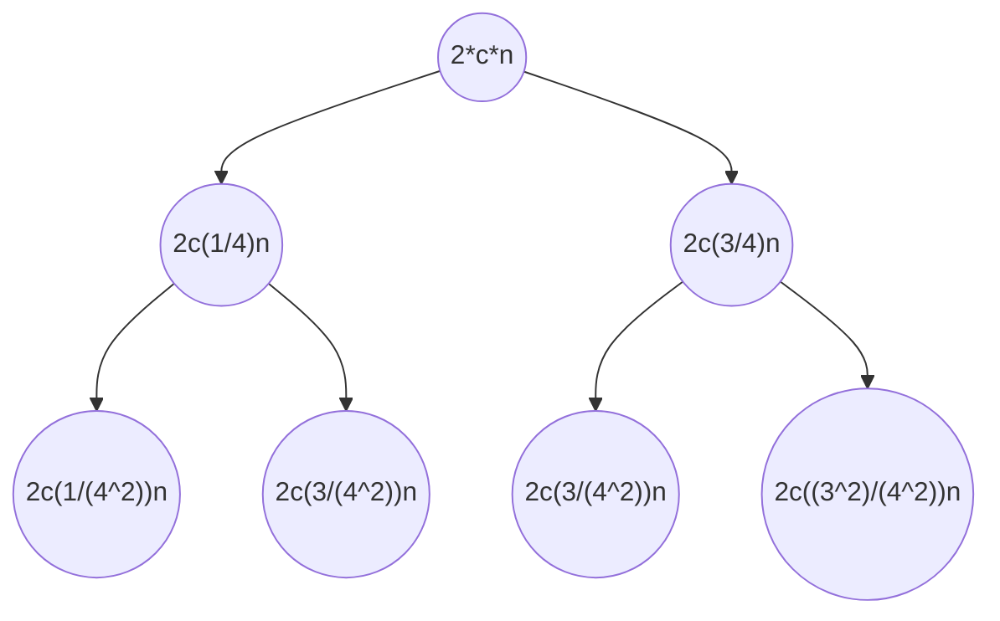

# Randomized quicksort

- **Idea:** Choose pivot randomly
- Leads to change in **time complexity**

### Algortihm

**Repeat**
- Pick $x$ at random
- Partition with respect to $x$
**Until**
- The resulting partition is still $x$

### Time complexity analysis

##### Worst case
...

##### Time complexity calculation
$T(n)=T\left (\frac{n}{4}  \right )+T\left (\frac{3}{4}n  \right )+E\left [ \texttt{nr. iteration of choosing pivot} \right ]\cdot c\cdot n$

$T(n)=O(n logn)$ in Expectation (but worst case is still $O(n^2)$ )

> [!NOTE]
> - $n$ is due to partition function
> - In expectation the E[ ] term become 2 due to P(good)
> - $O(n)$ per level
> - $log\frac{4}{3}(2cn)$ is the height of the worst case (rightmost branch)
> - $log\frac{4}{3}(2cn)=O(log_{2}n)$

### Properties
- Is **Stable** (preserves keys order)

# Sorting algortihms comparison

