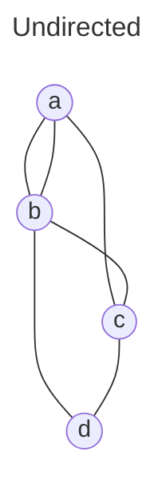
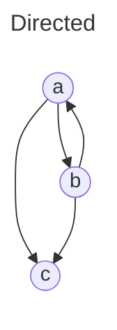

# Amortised Analysis
*Chapter 17.1-17.2 of Cormen's book*

- $n =$ # of items
- $\alpha=\frac{n}{m}=$ load factor
- Expected time $\Theta(1+\alpha)$
- Space $\Theta(m+n)$

- Idea: grow/shrink table
- $m\geq n$ 
- $m^{'}=2m$
- Whenever $n>m \Rightarrow$ increase size
- $n\rightarrow m^{'}>m$ $T \rightarrow T^{'}$
- Make new table of size $m^{'}$
- Build new hash function $h^{'}$
- Rehash:
```
for item in T
	T'.insert(item)
```
- $\Theta(n+m+m^{'})$

$$
\Theta(1+2+4+8+16+\dots \quad \cdot n) = \Theta\left( \sum_{i=1}^{\log n} 2^{i}\right)=\frac{\Theta(n)}{n}=\Theta(1)
$$

Def: operations take " $T(n)$ amortised" time if $k\geq 1$ operations take $k\cdot T(n)$ time

#### Deletions
- if $m=2n \rightarrow$ shrink
	- problem: linear time in insertion and deletion

- if $m=4n \rightarrow$ halve
- $m^{'}=\frac{m}{2}$
- $\Theta(m+n)$
- if $m < n$ double
- $n\leq m \leq 4n$ 

### Amortised bounds
- Assign amortised cost to each operation state that it "preserves the sum"
	- $\\sum_{nr. op}$ amortised cost $\geq \\sum_{nr. op}$  actual cost

#### Aggregate analysis
- Stack `S`, operations:
	- `push(x)` $\Theta(1)$
	- `pop(S)` $\Theta(1)$
	- `Mpop(s,k)` = pops $k$ items, $\Theta(min\left\lbrace k, |S| \right\rbrace) \rightarrow \Theta(n)$ 
- Total cost of $n$ operations $\rightarrow O(n^2)$
	- time(pop)$\leq$time(push) = $\Theta(n) \Rightarrow \Theta(1)$ amortised per operation

## Accounting
- An operation can store credit in the bank account
- Balance always $\geq 0$
- Allow operations to take coins from the bank to pay for its time
	- $2f(n)$ store coins when making an operation
	- Double form $m=2^k \rightarrow m^{'}=2^{k+1}$ , cost $\Theta(2\cdot 2^{k+1})$ 
	- Shrink table from $2^{k+2}$ to $2^k$ 

# Graphs



- $V=\left\lbrace a,b,c,d \right\rbrace$
- $E=\left\lbrace \{a,b\},{a,c} \right\rbrace$ 


- **Walks**: sequences of consecutive edges
- **Paths**: walks that do not repeat any vertex
- **Cycles**: closed walks

### Representations
1. **Adjacency lists**
	- Array of Adj of size $|V|$ of linked lists:
		- `Adj[u]`= list of all vertices linked to $u$ by an edge
		- $\left\lbrace  v\in V | (u,v) \in E \right\rbrace$ 
[img]
1. **Adjacency matrices**
	- $|V| \times |V|$ matrices
	- $$
A[u,v]=
\left\{\begin{matrix}
1\;\text{if}(u,v)\in E\\
0\;\text{otherwise}
\end{matrix}\right.
$$
[img]
