# Multiple Pattern Matching problem
Input: $P_1, P_2,\dots, P_k,\space T$ \
Output: Occurrence($P_i$)$\forall i \in [i,k]$

Time Complexity: $O(\sum_{i=1}^{k}|P_i|+k\cdot |T|)$ = Goal: $O(\sum_{i=1}^{k}|P_i|+|T|)$

### Trie (data structure)
- Rooted tree that represents a set of strings
- Edges lebeled with letters
- Property: no two edges going out from a node have the same label

Ex. {ana, ann, anna, anne}


- Trick: append a fake char $\$$ with $\$\notin\varepsilon$ 
  - So each string can be read from the root to the leaf
  - Without this, if prefix is present we have a path

Ex. {ana, ann, anna, anne}


- Number of nodes in worst case:
  - O(Sum of characters)
  - E.g. $|T_1|=n, |T_2|=m, |T_3|=q,$ is $O(n+m+q)$

#### Compacted tries
- Edges labeled with strings
- No two edges from  node start with the same letter


- Number of nodes in worst case:
  - $\sum_{i=1}^{\log n} \frac{n}{2^i}=O(n)$
  - Is a complete binary tree (half number of nodes going up)
  - Number of nodes is linear to the number of leaves (number of strings in the tree)

- A compacted trie representing $k$ strings has $O(k)$ nodes.

##### Suffix Tree of a string $T$:
- Compacted trie of all the suffixes of $T$

E.g.
`banana$` (length 7) \
suffixes (7):`$` `a$` `na$` `ana$` `nana$` `anana$` `banana$`\

if $P=$`ana` we arrive a node with many leaves, they are the starting position of $P$ in $T$\
if $P=$`baba` we don't find a path to a leaft, so it's not present

```mermaid
graph TB

ida(( )) -- $ --> id7((7));
ida(( )) -- a --> idb(( ));
ida(( )) -- na --> idc(( ));
ida(( )) -- banana$ --> id1((1));

idb(( )) -- $ --> id6((6));
idb(( )) -- na --> idd(( ));

idc(( )) -- na$ --> id3((3));
idc(( )) -- $ --> id5((5));

idd(( )) -- $ --> id4((4));
idd(( )) -- na$ --> id2((2));

subgraph subpt [ ]
id7((7))
id6((6))
id4((4))
id2((2))
id1((1))
id5((5))
id3((3))
end
style subpt fill:none, stroke:none;

classDef path fill:#444, stroke:none;
class ida,idb,idc,idd, path;

classDef pattern fill:#EEF, stroke:#444;
class id1,id2,id3,id4,id5,id6,id7 pattern;
```




Pattern matching with $ST$

- Preprocess $T$
- Build the $ST$ of $T$

```py
ST(T)
    - Spell P from the root of ST(T)
    if P exhausted at node V
        occ <- leaves below the node V
    else
        occ <- empty set
```

Representation of Children\
$|T|=n$, $|P|=m$

DS | Space ST | Time for pattern M
--- | --- | ---
List of pointers | $O(\|T\|)$ | $O(\|\Sigma\|\|P\|)$
BST | $O(\|T\|)$ | $O(\|P\|\log \|\Sigma\|)$
Array of size $\Sigma$ |  $O(\|\Sigma\|\|T\|)$ | $O(\|P\|)$
Hash tables | $O(\|T\|)$ | $O(\|P\|)$

Note: Hash tables does not maintain order (I cannot sort or read in order)

$O(|P|+|occ|)$

ST $O(|T|+\sum_{i=1}^{k}|P|+occ)$


Counting pattern occurences
Input: text $T$, pattern $P$ \
Output: number of occ. of $P$ in $T$

$O(P)$

- Substrings that are repeated more than one time -> corrispond to an internal node
- Longest repeated substring 

##### Longest Common Prefix
The lowest common ancestor of two nodes $u$ and $v$ is the deepest node that is an ancestor of both $u$ and $v$