## Brute force construction

```py
BruteForceConstruction
    ST <- root,
    add leaf L and branch (root, 1) with label [1,|T|+1]
    for i=2 to |T|
        spell T[i,...,|T|+1] from the root of ST
        create a new node where the spelling stops, splitting the edge
        create a new edge from the new node to a new leaf i
    return ST
```

Time Complexity: $\Theta(n^2)$

E.g. $T$=`mississippi$`

```mermaid
graph TB

ida(( )) -- mississippi$ --> id1((1));
ida(( )) -- s --> idb(( ));
ida(( )) -- p --> idc(( ));
ida(( )) -- i --> idd(( ));
ida(( )) -- $ --> id12((12));

idb(( )) -- si --> ide(( ));
idb(( )) -- i --> idf(( ));

idc(( )) -- pi$ --> id9((9));
idc(( )) -- i$ --> id10((10));

idd(( )) -- ssi --> idg(( ));
idd(( )) -- $ --> id11((11));
idd(( )) -- ppi$ --> id8((8));

ide(( )) -- ssippi$ --> id3((3));
ide(( )) -- ppi$ --> id6((6));

idf(( )) -- ippi$ --> id7((7));
idf(( )) -- ssippi$ --> id4((4));

idg(( )) -- ppi$ --> id5((5));
idg(( )) -- ssippi$ --> id2((2));

subgraph subpt [ ]
id1((1))
id2((2))
id3((3))
id4((4))
id5((5))
id6((6))
id7((7))
id8((8))
id9((9))
id10((10))
id11((11))
id12((12))
end

style subpt fill:none, stroke:none;

classDef path fill:#444, stroke:none;
class ida,idb,idc,idd,ide,idf,idg path;

classDef pattern fill:#EEF, stroke:#444;
class id1,id2,id3,id4,id5,id6,id7,id8,id9,id10,id11,id12 pattern;

```



$S_4$ = path label of node 4 = `issi`

### Suffix links
$Slink(u)=V$ state that $S_v$ is the longest proper suffix of $S_u$

Exist $\alpha\in\Sigma$, $S_v=\alpha S_v$

$O(n \log |\Sigma|)$\
$O(n)$\
$O(n^{\Theta(1)}) = |\Sigma|$\
$O(|T|+|P|+occ)$


#### Suffix Array of T
- An array of size $|T|+1$
- $SA[i]=j$, $j\in [1,|T|]$
- such that $T[j,\dots,|T|]$ is the i-th lex smallest suffix of T

```py
$ [7]
a$ [6]
ana$ [4] 'SA of banana$'
anana$ [2]
banana$ [1]
na$ [5]
nanas$ [3]
```



```mermaid
graph TB

ida(( )) -- $ --> id7((7));
ida(( )) -- a --> idb(( ));
ida(( )) -- na --> idc(( ));
ida(( )) -- banana$ --> id1((1));

idb(( )) -- $ --> id6((6));
idb(( )) -- na --> idd(( ));

idc(( )) -- na$ --> id3((3));
idc(( )) -- $ --> id5((5));

idd(( )) -- $ --> id4((4));
idd(( )) -- na$ --> id2((2));

ida(( )) --> ida(( ));
idb(( )) --> ida(( ));
idc(( )) --> idb(( ));
idd(( )) --> idc(( ));

subgraph subpt [ ]
id7((7))
id6((6))
id4((4))
id2((2))
id1((1))
id5((5))
id3((3))
end
style subpt fill:none, stroke:none;

linkStyle 10,11,12,13 stroke:red,stroke-width:1px,color:red;

classDef path fill:#444, stroke:none;
class ida,idb,idc,idd, path;

classDef pattern fill:#EEF, stroke:#444;
class id1,id2,id3,id4,id5,id6,id7 pattern;
```

Spiegazione ultima mezz'ora

$O(|P|\log |T|)$

### LCP Array
- Lenght $|T|$
- $LCP[i]$ stores the length of the common prefix of $SA[i-1]$ and $SA[i]$
- You can do the same things of suffix trees