```mermaid
graph TB;

a(( ))
b(( ))
c(( ))
d(( ))
e(( ))
f(( ))

subgraph subpt [ ]
s1((1))
s2((2))
s3((3))
s4((4))
s5((5))
s6((6))
s7((7))
s8((8))
s9((9))
s10((10))
s11((11))
s12((12))
s13((13))
end

a-->b
a-->c
a-->d
a-- missi$ -->s1
a-- $ -->s6
a-- # -->s13
b-->e
b-->f
c-- ssi$ -->s2
c-- $ -->s5
c-- ppi# -->s9
c-- # -->s12
d-- pi# -->s10
d-- pi# -->s11
e-- $ -->s3
e-- ppi# -->s7
f-- $ -->s4
f-- ppi# -->s8

style subpt fill:none, stroke:none;

classDef path fill:#444, stroke:none;
class a,b,c,d,e,f path;

classDef pattern fill:#EEF, stroke:#444;
class s1,s2,s3,s4,s5,s6,is7,s8,s9,s10,s11,s12,s13 pattern;
```

- remove artificial suffixes

### Longest Commons Substring (LCS)

Input: Strings S and T
Output: (The length of) the longest substring R which occurs both in S and T

Time complexity = $\Theta(|T|+|S|)$

## Shift-and

Input: T, P
Preprocessing: build $|\Sigma|$ arrays of size $|P|$ each
Method: build matrix M of size $|P|x|T|$

$U_x[i]=\begin{cases}
    1 \quad \text{if}\space p[i]=x\\
    0 \quad \text{otherwise}
\end{cases}$

Es.
$T=\text{california}$,
$P=\text{for}$

$\Sigma=\{\text{a, c, f, i, l, n, o, r}\}$\
$U_f=[1, 0, 0]$\
$U_o=[0, 1, 0]$\
$U_r=[0, 0, 1]$\
$U_a=[0, 0, 0]=U_c=U_i=U_l=U_n$

Columns j>i
$M[i,j]= \begin{cases}
    1 \quad \text{if i chars of P match a portion of T ending at j} \\
    0 \quad \text{otherwise}
\end{cases}$

$M[i,j]=\text{bit-shift}(M[i,j-1]) \text{AND} \space U_{T[j]}$


Bit shift operation

101001 -> 110100

```
And = 101001
      110100
        =
      001001
```

 - |c | a | l | i | f | o | r | n | i | a
--- | --- | --- | --- | --- | --- | --- | --- | --- | --- | ---
f | 0 | 0 | 0 | 0 | 1 | 0 | 0 | 0 | 0 | 0
o | 0 | 0 | 0 | 0 | 0 | 1 | 0 | 0 | 0 | 0
r | 0 | 0 | 0 | 0 | 0 | 0 | [1] | 0 | 0 | 0 

[1] is output

$M[i,1]= \begin{cases}
    \text{zeroes if i chars of} P[i]!=T[i] \\
    10010\space P[i]=T[i]
\end{cases}$

$w$ = word size (bit?)\
Bit-shift operation and AND operation take $\Theta(1)$ for bit arrays of size $\Theta(w)$

If $|P|=O(w)\Rightarrow\Theta(1)$ time for computing each column $\Rightarrow\Theta(|T|)$ time in total

For $|P|=\Sigma(w)\Rightarrow\Theta(|T|\cdot |P|)$ time